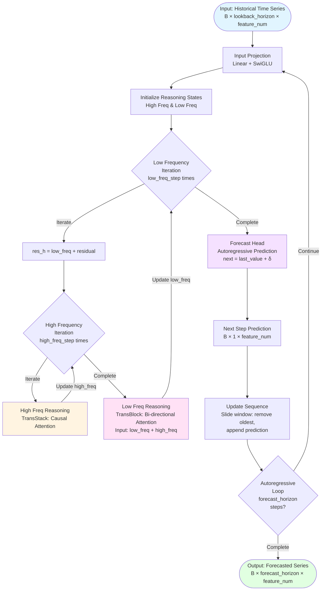

# Overthink: A Hierarchical Reasoning Framework for Time Series Forecasting

## Quick Start

1. **Install [uv](https://github.com/astral-sh/uv):**

```sh
pip install uv
```

2. **Run the example script using uv:**

```sh
uv run example.py
```

This will install dependencies and execute `example.py` in a single step.

## Model Overview

Overthink implements a hierachical reasoning model for time series autoregressive forecasting.

## Architecture Flowchart



### Key Highlights

1. Feature mixing.
2. Efficient hierarchical reasoning for high and low frequency components.
3. Can be trained with multi-scale trend following loss for strong trend forecasting performance.

## TODO

1. Add active computatation time support.
    - Not sure if ACT is beneficial for this model at the moment.
2. Adapt personal training pipeline for large scale experiments.
    - Full market portfolio builder.
    - Automatic train -> eval -> backtest -> report pipeline.
3. TBD
