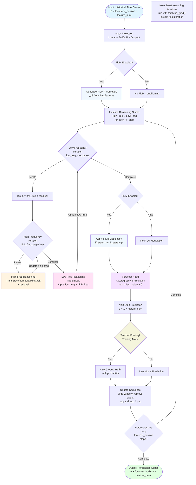

# Overthink: A Hierarchical Reasoning Framework for Stock Market Intraday Forecasting

Overthink implements a hierarchical reasoning model for stock market intraday forecasting.

This implementation is inspired by the [Hierarchical Reasoning Model (HRM)](https://github.com/sapientinc/HRM) by Sapient Intelligence, adapted specifically for stock market forecasting tasks.

## Quick Start

1. **Install [uv](https://github.com/astral-sh/uv):**

```sh
pip install uv
```

2. **Run the basic example script using uv:**

```sh
uv run example.py
```

3. **Run the FiLM-conditioned example:**

```sh
uv run example_film.py
```

This will install dependencies and execute the example scripts in a single step.

## Model Overview

### Architecture Flowchart



Instead of creating a large deep tranformer model, Overthink creates a shallow stack of transformer layers but running them on a deep reasoning loop. This results in a model that can strike a balance between memory bandwidth and computational efficiency. Meanwhile, as the parameters are converging
to a stationary point, most of the deep reasoning loop iterations are run with no_grad, further improving efficiency during inference. The combination of shallow transformer layers and deep recursive loops lead a tendancy of overfitting, however, preliminary experiments and backtestings show that this may actually be beneficial for intraday stock market forecasting. Our naiive interpretation is that most traders being it human or bot, are usually just doing pattern matching on short-term historical performance.

Some other mechanisms employed to improve stock market forecasting performance include:

1. **FiLM Conditioning:** Feature-wise Linear Modulation (FiLM) layers are used to condition the model on additional contextual information, such as market indicators or macroeconomic data. When enabled, FiLM parameters (γ, β) are generated from film_features and applied to the low-frequency reasoning state.

2. **Intraday Time Phase Encoding:** Specialised positional encodings as time phase during trading session are added to input features. An early feature mixing layer is used to modulate input features so the model can learn intraday time-dependent patterns effectively.

3. **Multi-scale trend loss:** Loss functions that capture trends on multiple time scales, that adapts to most used intraday technical analysis indicators.

## Important Configuration Parameters

### Core Time Series Parameters

- `feature_num`: Number of input/output features
- `lookback_horizon`: Number of *intended* past time steps to consider, the model can handle unbounded sequence lengths with potential degraded performance
- `forecast_horizon`: Number of *intended* future time steps to predict, the model can autoregressively predict unbounded sequence lengths with potential degraded performance
- `batch_size`: Batch size for training
- `decoder_only`: Whether to use decoder-only architecture (causal attention only)

### Model Architecture Parameters

- `high_freq_step`: Number of high-frequency reasoning steps per low-frequency step
- `low_freq_step`: Number of low-frequency reasoning steps
- `hidden_layer_num`: Number of hidden layers
- `hidden_size`: Hidden dimension size
- `head_num`: Number of attention heads

### Transformer Parameters

- `temporal_mechanism`: Whether to use "attention" (TransStack) or alternative temporal mixing mechanism (TemporalMixStack)
- `use_causal`: Whether to use causal masking in attention
- `use_rope`: Whether to use Rotary Positional Embeddings
- `expansion_factor`: MLP expansion factor (default: 4.0)
- `attn_dropout`: Dropout rate for attention weights
- `mixing_dropout`: Dropout rate for mixing layers
- `input_mixing_dropout`: Dropout rate for input feature mixing layer

### FiLM Parameters (Optional)

- `use_film`: Whether to enable FiLM conditioning
- `film_feature_num`: Number of FiLM conditioning features
- `film_hidden_size`: Hidden size for FiLM MLP
- `film_dropout`: Dropout rate for FiLM layers

### Training Parameters

- `teacher_forcing`: Whether to use teacher forcing during training
- `teacher_forcing_ratio`: Probability of using ground truth instead of model prediction during training

### Forecast Parameters

- `forecast_aggregation`: 'mean', 'ema', or 'last' for output aggregation
- `forecast_ema_period`: EMA period for smoothing (if using EMA)
- `forecast_residual_scale`: Scaling factor for residual connections
- `learnable_forecast_residual_scale`: Whether to make residual scale learnable

## Usage Examples

- `example.py`: Basic usage example without FiLM conditioning
- `example_film.py`: Example with FiLM conditioning
- `example.ipynb`: Jupyter notebook example for interactive exploration
